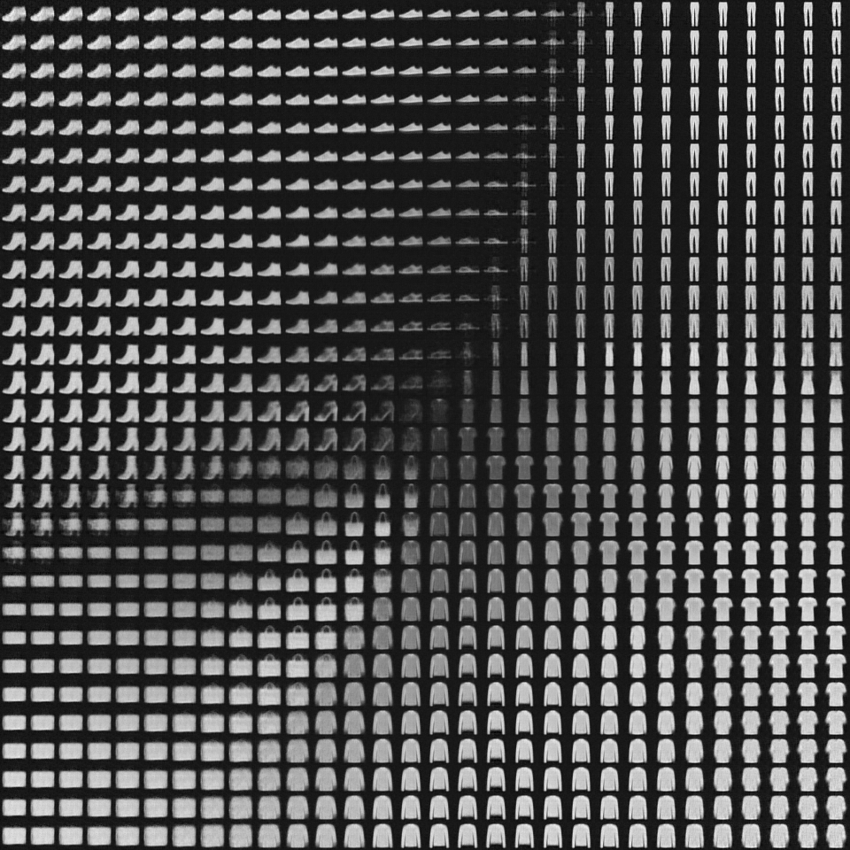

# variational-autoencoder
this is an implementation of [variational autoencoder](https://en.wikipedia.org/wiki/Variational_autoencoder) using pytorch-lightning.
there are some helper classes for a lightning datamodule (with support for tran-validation split) and lightning model.

after training with a 2d latent space, the latent space looks like this:

